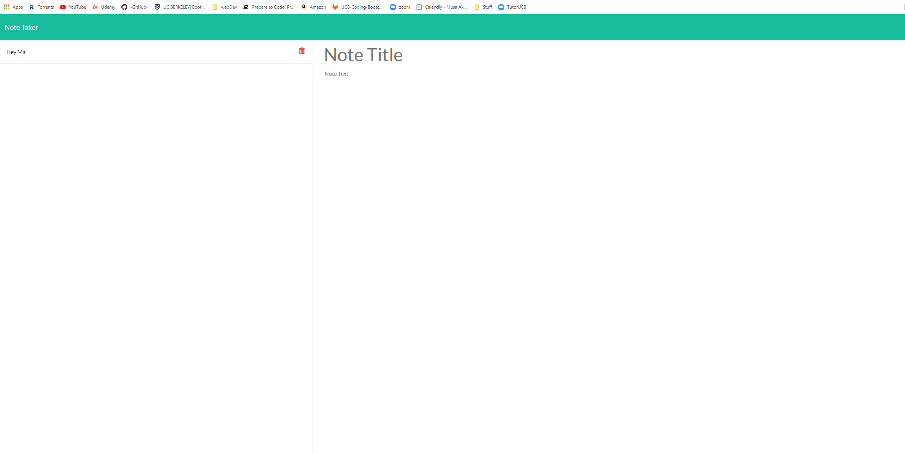

## Username
## Kerry-jr
# Title
#### Note Taker
# Table of contents:
1. Description
1. Installation
1. Usage
1. Test
1. Contributors
##### Description
1.)C reated an application that can be used to write, save, and delete notes. This application will use an express backend and save and retrieve note data from a JSON file.
##### Installation
2.)npm i
##### Usage
3.)Taking notes
##### Test
4.)N/A
##### Contributors
5.)None
##### Licenses
6.)No license
##### Email
7.)[My Email. Please click me to send a message](mailto:kerrysfs@gmail.com)

[Github repo link](https://github.com/Kerry-Jr "Your github repo")
  

  
 
  

  

